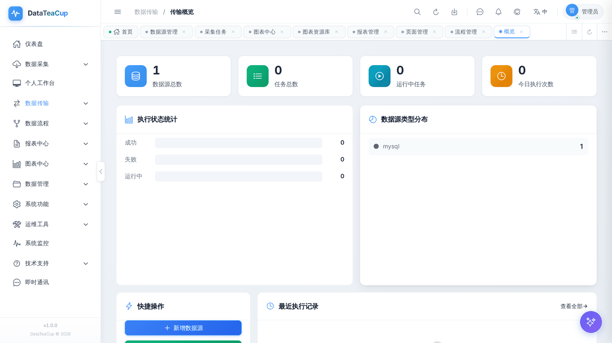
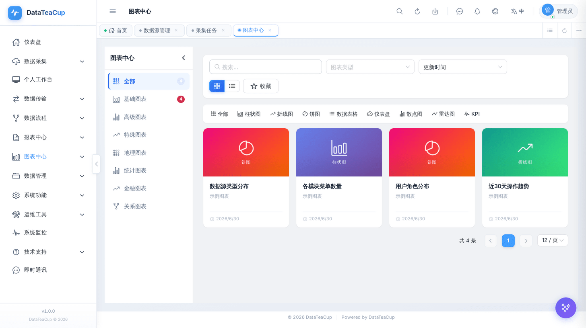
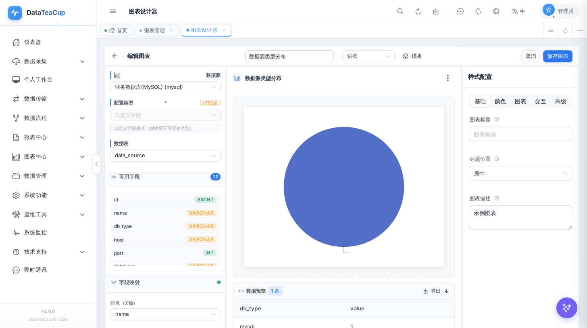
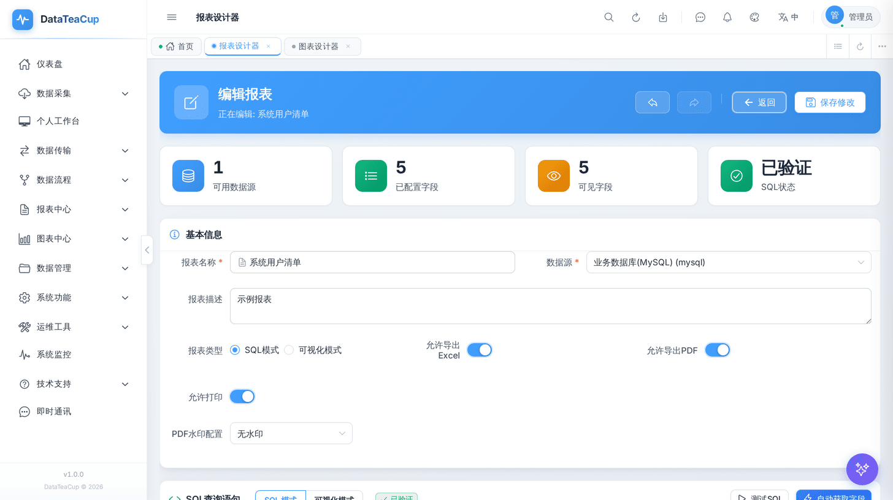
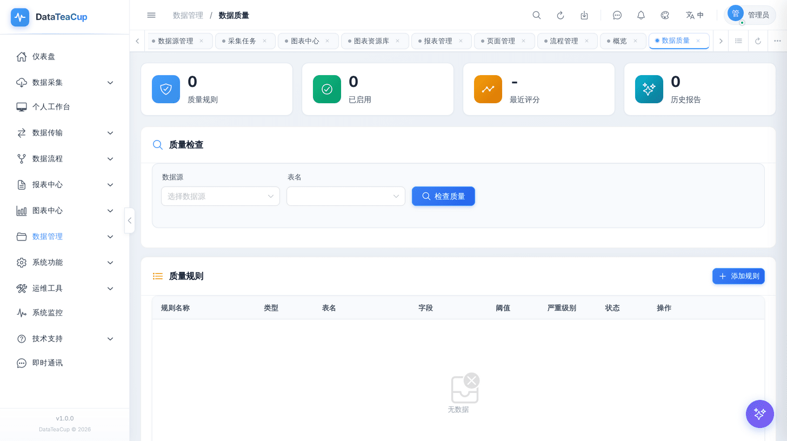
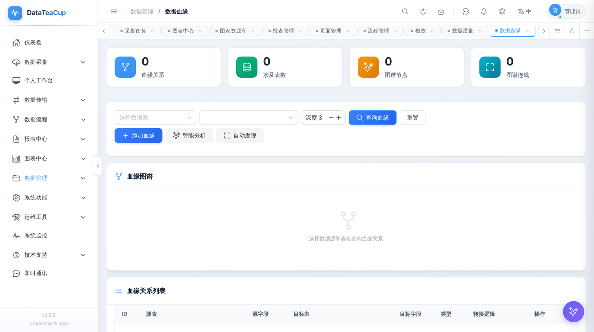
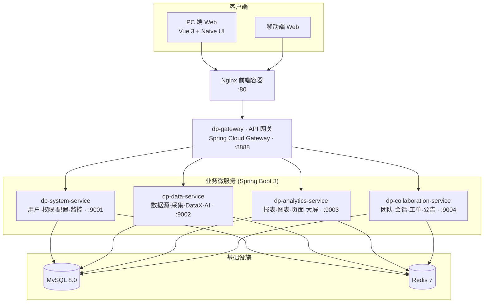

<div align="center">

# DataTeaCup · 数据茶杯

**一站式企业级智能数据平台 —— 数据接入、治理、报表、可视化与 AI 分析的开源底座**

[](LICENSE)
[](https://openjdk.org/)
[](https://spring.io/projects/spring-boot)
[](https://spring.io/projects/spring-cloud)
[](https://vuejs.org/)
[](https://www.typescriptlang.org/)
[](docker-compose.yml)

<p>
  <a href="https://github.com/Anibl-1/DataTeaCup">GitHub</a> ·
  <a href="https://gitee.com/kou-xibin/DataTeaCup">Gitee</a> ·
  <a href="#-快速开始">快速开始</a> ·
  <a href="#-功能模块总览">功能总览</a> ·
  <a href="#-核心模块详解">核心模块</a> ·
  <a href="#-界面预览">界面预览</a>
</p>

</div>

---

DataTeaCup（数据茶杯）是一套**可运行、可扩展、可私有化部署**的开源数据平台。它把数据源接入、数据采集、数据同步（DataX）、数据流程编排、低代码报表、ECharts 可视化、数据治理、AI 数据分析和团队协作整合进同一套工作台，帮助团队从「散落在脚本、Excel、数据库客户端和临时看板里的数据工具」升级为「统一、可治理、可二次开发的数据中台」。

后端采用 **Java 17 + Spring Boot 3 + Spring Cloud Gateway** 微服务架构，前端采用 **Vue 3 + TypeScript + Vite**，内置桌面端与移动端两套视图，提供完整的 SQL 初始化脚本与 Docker Compose 一键部署，开箱即用。

> 关键词：`BI` · `数据中台` · `数据集成` · `数据采集` · `DataX` · `数据流程编排` · `低代码报表` · `可视化大屏` · `ECharts` · `数据质量` · `数据血缘` · `AI 数据分析` · `Spring Boot` · `Vue 3`

## ✨ 核心亮点

- **一站式数据工作台**：数据接入 → 采集/同步 → 治理 → 报表/图表 → 页面/大屏 → AI 分析，全链路在一个平台内闭环。
- **微服务架构，企业级可扩展**：网关 + 4 个业务服务独立部署、独立扩容，适合内网部署与行业化二次开发。
- **低代码 + 设计器**：报表设计器、图表设计器、页面设计器、数据流程设计器，拖拽即可构建数据应用。
- **AI 原生**：内置 SQL 生成、数据分析、SQL 优化、智能图表、文件识别、数据洞察等能力，不绑定厂商，支持 OpenAI 兼容 API、DeepSeek、Qwen、Ollama。
- **完善的权限与安全**：RBAC 用户/角色/菜单/按钮权限、行级安全（RLS）、数据脱敏、操作与登录审计、JWT + Sa-Token。
- **桌面端 + 移动端**：同一套后端，自动适配 PC 与移动端视图。
- **开箱即用的部署**：完整 SQL 初始化脚本 + Docker Compose，`docker compose up` 一键拉起 MySQL、Redis、微服务、网关与前端。
- **友好的开源协议**：基于 Apache License 2.0，对学习、商用集成和二次开发友好。

## 🖼 界面预览

> 完整尺寸截图位于 [`docs/assets/screenshots/`](docs/assets/screenshots)。

<div align="center">


</div>

| 数据仪表盘 | 数据源管理 |
| :---: | :---: |
|  |  |
| **数据传输（DataX）** | **图表中心** |
|  |  |
| **图表设计器** | **报表管理** |
|  |  |
| **报表设计器** | **AI 助手** |
|  |  |
| **数据质量** | **数据血缘** |
|  |  |
| **系统监控** | |
|  | |

## 🧭 适用场景

- 企业内部 **BI 平台 / 数据门户 / 经营分析看板**。
- 数据团队**统一管理数据源、采集任务、同步任务与报表资产**。
- 软件公司基于开源底座做**行业化报表、数据应用或私有化交付**。
- 需要把 **AI SQL、AI 数据分析、AI 报表/图表辅助设计**接入现有数据工作流。

## 🧩 功能模块总览

| 模块 | 能力 |
| --- | --- |
| **数据源管理** | MySQL、PostgreSQL、Oracle、SQL Server、SQLite、ClickHouse、Trino 等多源连接管理，支持连接测试、批量测试、元数据读取与密码加密存储 |
| **数据采集** | 全量 / 增量 / 自定义 SQL 采集，任务调度、重试、采集日志、数据导入与库表管理 |
| **数据传输（DataX）** | 基于 DataX 的库表同步：传输数据源、参数化传输任务、执行日志与运行监控 |
| **数据流程编排** | 可视化流程设计器、流程管理、执行监控与执行日志，串联采集、清洗、同步等步骤 |
| **数据管理 / 治理** | 表数据管理、数据视图、数据字典、数据质量规则与评分、数据血缘与影响分析、查询构建器 |
| **报表中心** | 低代码报表设计器、多数据源查询、分页预览、报表版本、Excel / CSV / PDF / ZIP 导出与移动端发布 |
| **图表中心** | 基于 ECharts 的图表设计器与图表资源库，支持折线、柱状、饼图、雷达、漏斗、指标卡、词云等，含 AI 智能图表设计 |
| **页面与大屏** | 拖拽式页面设计器、仪表板页面、可视化大屏、图表嵌入、在线预览与移动端页面 |
| **AI 助手** | SQL 生成、数据分析、SQL 优化、智能图表、文件识别、AI 对话、数据洞察、Prompt 模板 |
| **团队协作** | 团队空间、即时通讯、工单管理、知识库、公告管理与资源共享 |
| **权限与安全** | RBAC 用户 / 角色 / 菜单 / 按钮权限、行级安全（RLS）、数据脱敏、JWT + Sa-Token 登录安全 |
| **系统与运维** | 用户/部门/岗位/字典/系统配置、系统监控、告警管理、慢查询分析、健康检查、操作 / 登录日志、导出中心、使用统计、在线升级 |

## 🔍 核心模块详解

### 📊 报表中心

面向「取数即出报表」场景的低代码报表引擎，从 SQL 到可分发的报表资产一站式完成。

- **双模式设计器**：支持 **SQL 模式**（直接编写参数化查询）与 **可视化模式**（拖拽字段、配置维度/指标），内置 SQL 校验、测试执行与字段自动抽取。
- **多数据源 + 动态参数**：任意已接入数据源作为报表数据源，支持动态参数（日期、下拉、文本等）与运行时筛选，一份报表适配多场景。
- **多格式导出**：Excel / CSV / PDF / ZIP 批量导出，可配置 **是否允许导出 Excel / PDF、是否允许打印、PDF 水印**（无水印 / 文字水印等），满足合规分发要求。
- **版本管理**：报表版本快照、版本对比与回滚，变更可追溯（`report-version`）。
- **定时调度与订阅**：报表定时执行（`ReportScheduleController`）+ 邮件/通道订阅推送（`SubscriptionController`），实现「日报 / 周报」自动生成与分发。
- **分享与外链**：登录态分享、公开外链（`PublicShareController` / `ShareController`）与免登访问，便于跨团队协作。
- **报表模板**：内置/自定义报表模板（`ReportTemplateController`），一键复制快速建表。
- **移动端发布**：一键开启移动端访问，PC 与移动端共用同一报表定义。

### 📈 图表中心

基于 **ECharts** 的可视化中心，覆盖「图表设计 → 资源库管理 → 嵌入分发」全流程。

- **图表设计器**：选择数据源与数据表 → 字段映射（维度 X 轴 / 指标 Y 轴）→ 实时预览 + 数据预览，右侧提供「基础 / 颜色 / 图表 / 交互 / 高级」样式配置面板。
- **丰富图表类型**：折线图、柱状图、饼图 / 环形图、雷达图、漏斗图、散点图、仪表盘、热力图、关系图、地图、数据表格、KPI 指标卡等，按基础 / 高级 / 特殊 / 地理 / 统计 / 金融 / 关系分类管理。
- **图表资源库**：图表分组（文件夹）、收藏、检索、按类型/更新时间筛选，集中管理团队图表资产（`ChartFolderController`）。
- **联动与下钻**：图表联动配置（`ChartLinkController`），支持图表间参数联动与数据下钻分析。
- **嵌入与分享**：独立嵌入地址（`/embed/chart/:id`）可内嵌到第三方系统或页面/大屏，支持免登外链。
- **导出与水印**：图表支持 Excel / PDF 导出与 PDF 水印配置，控制粒度到单张图表。
- **AI 智能图表**：自然语言描述需求，AI 推荐图表类型、自动生成 SQL 与图表配置并一键落库（见「AI 智能分析」）。

### 🔀 数据流程编排（Pipeline）

可视化的 DAG 流程编排引擎，把采集、SQL、脚本、通知等步骤串成可调度、可监控的数据管道。

- **拖拽式 DAG 设计器**：画布拖拽节点 + 连线编排执行依赖，支持画布缩放、节点配置与流程校验。
- **多类型节点**（分组提供）：
  - **数据节点**：读取 / 写入数据库；
  - **脚本节点**：SQL 脚本、Shell 脚本、Python 脚本、HTTP 请求；
  - **控制节点**：条件分支、子流程调用、等待、前置任务依赖、错误处理（异常捕获与重试）；
  - **通知节点**：企业微信、钉钉、邮件（SMTP）、短信。
- **调度与依赖**：流程定时调度、流程间前置依赖（等待其他流程完成）、子流程复用。
- **执行监控**：流程执行记录、节点级执行日志、运行状态与进度跟踪，失败可重试。
- **告警闭环**：执行异常通过企微 / 钉钉 / 邮件 / 短信节点实时通知到人。

### 🤖 AI 智能分析

内置 **AI 数据助手**，不绑定厂商，兼容 **OpenAI 兼容 API、DeepSeek、Qwen、Ollama 本地模型**，覆盖从取数到洞察的全链路。

- **智能 SQL 生成**：选择数据源自动加载表结构，自然语言描述需求 → 生成可执行 SQL（`/ai/generate-sql`）。
- **SQL 优化与解释**：对 SQL 进行性能优化建议与逐句解释（`/ai/optimize-sql`、`/ai/explain-sql`）。
- **数据分析**：对查询结果做 AI 解读，输出结论与建议（`/ai/analyze`）。
- **数据洞察**：异常检测、趋势分析、智能告警与洞察报告（`AiInsightController`：`/ai/insight/anomalies`、`/trend`、`/report`、`/detect-and-alert`）。
- **AI 智能图表 / 报表 / ETL**：自然语言一键生成并落库图表、报表（含菜单）、ETL 任务（`/ai/generate-and-create-chart`、`/ai/create-report-with-menu`、`/ai/generate-etl`）。
- **AI 数据大屏**：自然语言生成仪表板与图表推荐（`NLDashboardController`：`/nl-dashboard/generate`、`/recommend-charts`）。
- **AI 血缘分析**：基于 SQL / 元数据自动推断字段级数据血缘（`/ai/analyze-lineage`）。
- **文件识别**：上传文件由 AI 解析结构与内容（`/ai/analyze-file`）。
- **流式对话与会话管理**：SSE 流式对话（`/ai/chat/stream`）、多会话管理、历史记录保存与检索。
- **Prompt 模板**：内置与自定义 Prompt 模板库，沉淀团队最佳实践（`/ai/prompt-templates`）。
- **用量统计与额度**：AI 调用次数统计与每日额度控制（`/ai/usage`、`/ai/usage/stats`，开源版默认每日 20 次）。

### 💬 即时通讯与团队协作

平台内置完整的协作与通信子系统（`dp-collaboration-service`），让数据工作在平台内闭环沟通。

- **即时通讯（IM）**：单聊 / 群聊会话、消息收发、已读回执、在线状态（`ChatController`：`/chat/conversations`、`/messages`、`/online-status`）。
- **团队空间**：多团队 / 工作空间隔离与成员管理，资源按团队共享（`TeamSpaceController`）。
- **工单管理**：工单创建、流转与处理，支撑数据需求 / 问题协同（`TicketController`）。
- **知识库**：沉淀团队文档与经验，与工单体系打通。
- **公告管理**：系统公告发布与触达（`AnnouncementController`）。
- **统一消息通道与通知**：站内通知 + 多通道触达（邮件 / 企微 / 钉钉 / 短信），可按模板与个人偏好配置（`NotificationController`、`MessageChannelController`、`NotificationTemplateController`、`NotificationSettingController`）。
- **评论协作**：报表 / 图表等资源上的评论讨论（`CommentController`）。

## 🏗 系统架构



**共享模块**

- `dp-common`：通用 DTO、异常、工具、缓存、Redis、Sa-Token 配置。
- `dp-core`：核心业务实体与服务。
- `dp-service-starter`：共享 Controller、Feign、拦截器、AOP 与公共配置。

## 🛠 技术栈

| 层级 | 技术 |
| --- | --- |
| **后端** | Java 17、Spring Boot 3.2、Spring Cloud 2023、Spring Cloud Gateway、MyBatis、MyBatis-Plus、Druid、Sa-Token、JWT、Hutool |
| **前端** | Vue 3、TypeScript 5、Vite 5、Naive UI、Pinia、Vue Router、ECharts、CodeMirror |
| **数据** | MySQL 8.0、Redis 7、Caffeine、DataX |
| **构建与部署** | Maven、npm、Docker、Docker Compose、Nginx |
| **AI** | OpenAI 兼容 API、DeepSeek、Qwen、Ollama |

## 🚀 快速开始

### 方式一：Docker Compose（推荐）

Docker Compose 会一次性启动 MySQL、Redis、4 个后端微服务、API 网关和前端 Nginx，首次启动时 MySQL 会自动执行 `docs/sql/full/datateacup_full.sql` 初始化数据库。

```bash
# 1. 准备环境变量（按需修改密码、AI Key 等）
cp .env.example .env

# 2. 构建并启动全部服务
docker compose up -d --build

# 3. 查看网关日志
docker compose logs -f gateway
```

启动完成后访问：

| 入口 | 地址 |
| --- | --- |
| 前端 | `http://localhost` |
| 网关健康检查 | `http://localhost:8888/api/health` |
| 默认账号 | `admin` |
| 默认密码 | `admin123` |

> ⚠️ 生产环境请务必修改 `.env` 中的 `JWT_SECRET`、数据库与 Redis 密码，并在首次登录后修改默认管理员密码。

### 方式二：本地开发

环境要求：**JDK 17、Maven 3.8+、Node.js 18+、MySQL 8.0+、Redis 7+**。

```bash
# 1. 初始化数据库
mysql -u root -p < docs/sql/full/datateacup_full.sql

# 2. 构建后端
mvn clean package -DskipTests

# 3. 分别启动后端服务
java -jar dp-system-service/target/dp-system-service-2.1.0-exec.jar        --spring.profiles.active=dev
java -jar dp-data-service/target/dp-data-service-2.1.0-exec.jar            --spring.profiles.active=dev
java -jar dp-analytics-service/target/dp-analytics-service-2.1.0-exec.jar  --spring.profiles.active=dev
java -jar dp-collaboration-service/target/dp-collaboration-service-2.1.0-exec.jar --spring.profiles.active=dev
java -jar dp-gateway/target/dp-gateway-2.1.0.jar

# 4. 启动前端
cd dp-ui
npm install
npm run dev
```

前端开发地址：`http://localhost:3000`。

## ⚙️ 配置说明

主要环境变量（完整列表见 [`.env.example`](.env.example)）：

| 分类 | 变量 | 说明 |
| --- | --- | --- |
| 数据库 | `DB_HOST` / `DB_PORT` / `DB_NAME` / `DB_USERNAME` / `DB_PASSWORD` | MySQL 连接信息（默认库名 `data_platform`） |
| 缓存 | `REDIS_ENABLED` / `REDIS_HOST` / `REDIS_PORT` / `REDIS_PASSWORD` | Redis 连接与会话缓存 |
| 安全 | `JWT_SECRET` / `USER_DEFAULT_PASSWORD` / `JASYPT_PASSWORD` | 令牌密钥、默认密码与配置加密密钥 |
| 端口 | `APP_PORT` / `GATEWAY_PORT` | 前端与网关对外端口 |
| AI | `AI_ENABLED` / `AI_PROVIDER` / `AI_API_KEY` / `AI_BASE_URL` / `AI_MODEL` | AI 能力开关与模型配置 |
| 许可 | `DATATEACUP_LICENSE_FILE` / `DATATEACUP_LICENSE_PUBLIC_KEY` | 商业授权文件路径与公钥 |

### AI 模型配置

DataTeaCup 不绑定特定 AI 厂商，支持任何 **OpenAI 兼容 API**。以 DeepSeek 为例：

```bash
AI_ENABLED=true
AI_PROVIDER=deepseek
AI_API_KEY=your-api-key
AI_BASE_URL=https://api.deepseek.com
AI_MODEL=deepseek-chat
```

也可切换为 `openai`、`qwen` 或本地 `ollama`。请勿将真实 API Key 提交到版本库。

## 📁 项目结构

```text
DataTeaCup/
├── dp-common/                  # 通用 DTO、异常、工具、缓存、Redis、Sa-Token 配置
├── dp-core/                    # 核心业务服务与实体
├── dp-service-starter/         # 共享 Controller、Feign、拦截器、AOP 和公共配置
├── dp-gateway/                 # API 网关（默认端口 8888）
├── dp-system-service/          # 系统服务：用户/权限/配置/监控（默认端口 9001）
├── dp-data-service/            # 数据服务：数据源/采集/DataX/AI（默认端口 9002）
├── dp-analytics-service/       # 分析服务：报表/图表/页面/大屏（默认端口 9003）
├── dp-collaboration-service/   # 协作服务：团队/会话/工单/公告（默认端口 9004）
├── dp-ui/                      # Vue 3 前端（含桌面端与移动端视图）
├── docs/sql/                   # 数据库结构、初始化数据与完整安装脚本
├── docs/assets/screenshots/    # 界面预览截图
├── docker-compose.yml          # 一键部署编排
├── Dockerfile                  # 后端服务镜像构建
└── README.md
```

## 🗄 数据库脚本

SQL 脚本位于 [`docs/sql/`](docs/sql)：

| 脚本 | 用途 |
| --- | --- |
| `docs/sql/full/datateacup_full.sql` | 完整一键安装脚本（建库、建表、视图、索引、初始化数据） |
| `docs/sql/schema/01_schema.sql` | 数据库结构脚本 |
| `docs/sql/data/02_seed_data.sql` | 安全初始化数据 |

- 全新安装推荐直接执行 `datateacup_full.sql`。
- 拆分安装可先执行 `schema/01_schema.sql`，再执行 `data/02_seed_data.sql`。
- 初始化数据仅包含默认管理员、角色权限、菜单、系统配置、字典、组织岗位、工作流默认规则和内置模板；运行日志、聊天记录、SQL 历史、导出记录等不会写入开源脚本。

更多说明见 [docs/sql/README.md](docs/sql/README.md)。

## 🔐 开源版本说明

未提供许可文件时，系统进入**默认限制模式**：项目正常启动、常规功能可用，高级额度按默认值限制。

| 限制项 | 默认值 |
| --- | ---: |
| 报表导出最大行数 | 100,000 行 |
| 图表中心页面数量 | 10 个 |
| 报表中心页面数量 | 20 个 |
| AI 每日提问次数 | 20 次 |
| 数据流程数量 | 10 个 |

商业授权使用 Ed25519 签名的 JSON 文件，默认路径：

- Docker 容器：`/app/license/datateacup-license.json`
- 本地运行：`runtime/license/datateacup-license.json`
- 环境变量覆盖：`DATATEACUP_LICENSE_FILE`
- Spring 配置覆盖：`datateacup.license.file`

## 🧰 常用命令

```bash
# 后端构建 / 测试
mvn clean package -DskipTests
mvn test

# 前端开发 / 生产构建
cd dp-ui && npm run dev
cd dp-ui && npm run build:docker

# Docker 部署
docker compose up -d --build
docker compose logs -f gateway
docker compose down
```

## 🤝 参与贡献

欢迎通过 Issue 提交问题、需求与使用反馈。如果这个项目对你有帮助，欢迎 Star、Fork 或二次开发。

提交 PR 前建议执行：

```bash
mvn test
cd dp-ui && npm run build:docker
mysql -u root -p < docs/sql/full/datateacup_full.sql
```

## 📄 许可证

DataTeaCup 基于 [Apache License 2.0](LICENSE) 开源协议发布。

---

<div align="center">

如果 DataTeaCup 对你有帮助，欢迎 ⭐ Star 支持一下！

<a href="https://github.com/Anibl-1/DataTeaCup">GitHub</a> · <a href="https://gitee.com/kou-xibin/DataTeaCup">Gitee</a>

</div>
