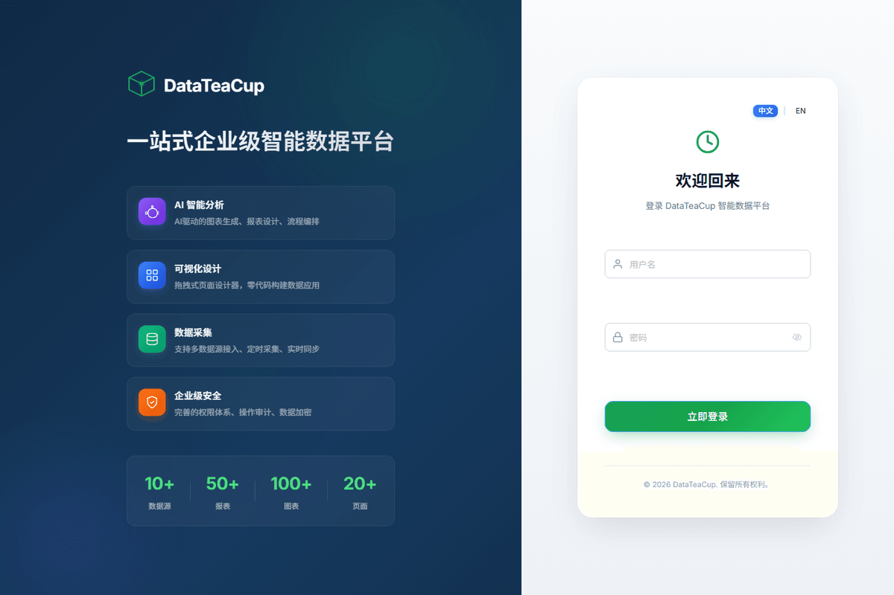
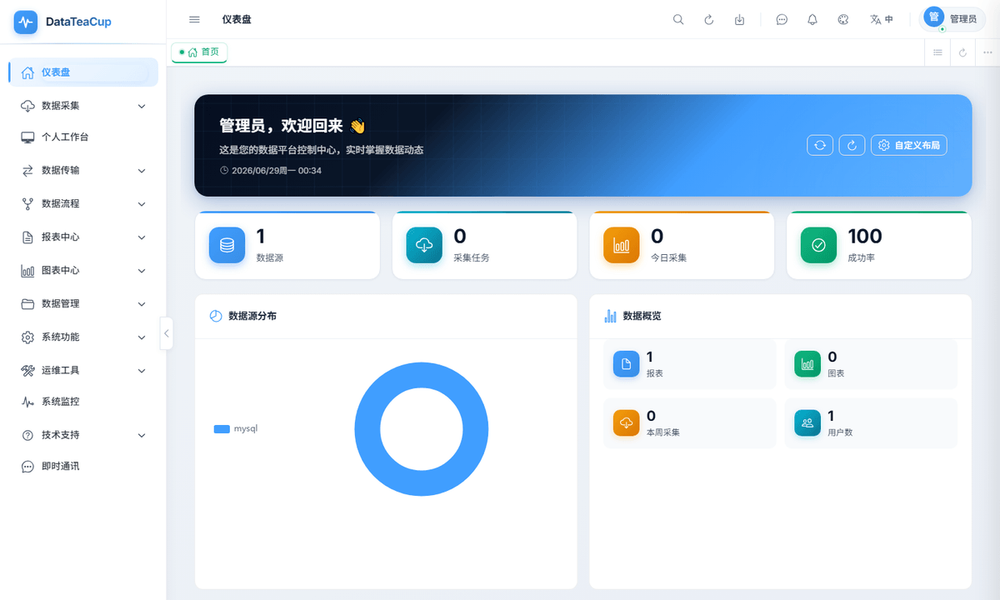
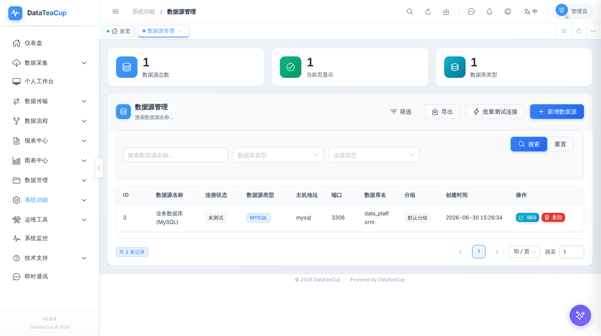
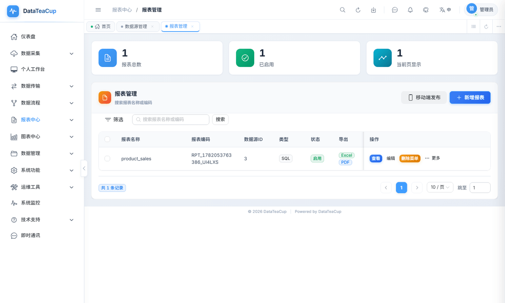
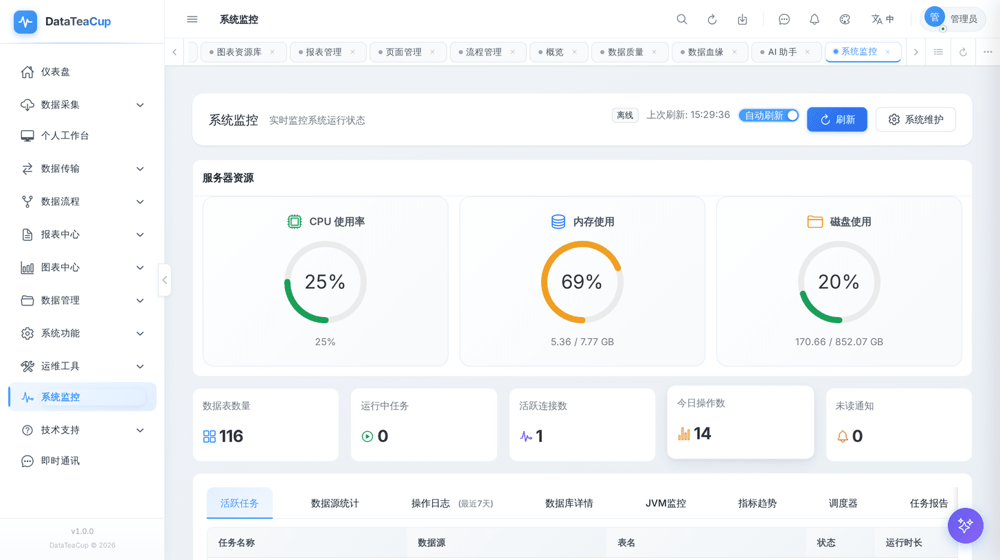
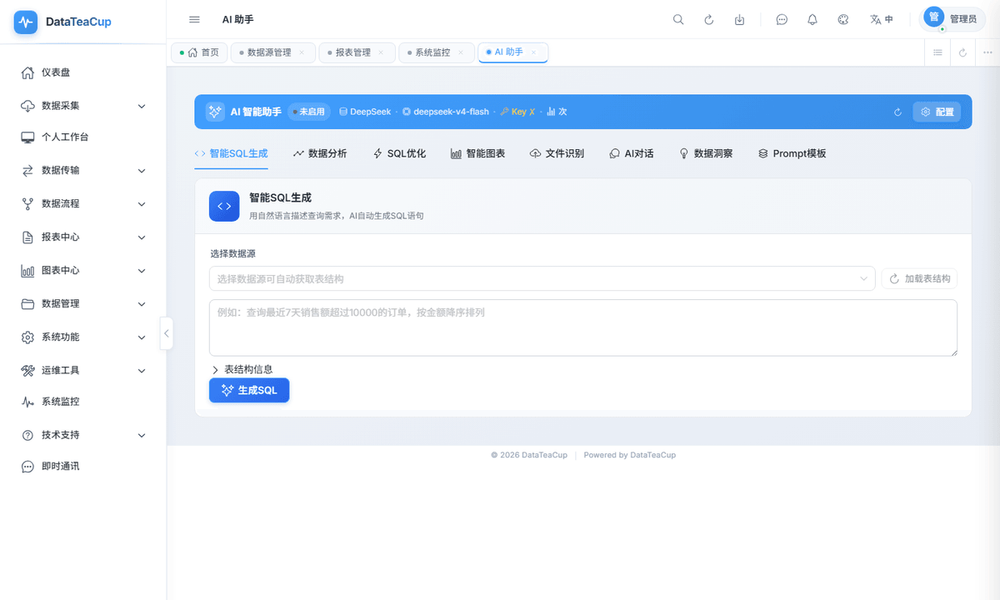

# DataTeaCup

DataTeaCup（数据茶杯）是一套公开开源的数据集成与智能 BI 平台，面向需要自建数据中台、报表平台、可视化看板和 AI 数据分析能力的团队。项目适合学习、二次开发、私有化部署和行业化数据应用交付。

[](LICENSE)
[](https://openjdk.org/)
[](https://spring.io/projects/spring-boot)
[](https://vuejs.org/)
[](docker-compose.yml)

关键词：`BI`、`数据集成`、`数据采集`、`DataX`、`报表设计`、`可视化大屏`、`ECharts`、`数据质量`、`数据血缘`、`AI 助手`、`Spring Boot`、`Vue 3`。

> 如果你正在寻找一个可运行、可扩展、可私有化部署的数据平台底座，DataTeaCup 值得收藏、Star 和二次开发。

## 界面预览



| 仪表盘 | 数据源管理 |
| --- | --- |
|  |  |

| 报表管理 | 系统监控 |
| --- | --- |
|  |  |

| AI 助手 |
| --- |
|  |

## 为什么是 DataTeaCup

很多团队的数据工具会散落在脚本、Excel、数据库客户端、低代码报表和临时看板之间。DataTeaCup 希望把这些高频能力放到一个可私有化部署、可二次开发、可渐进扩展的平台里：

- 数据源接入、采集、同步、报表、图表、页面设计在同一套工作台完成。
- 后端采用 Java 17 + Spring Boot 3 微服务架构，适合企业内网部署和定制开发。
- 前端采用 Vue 3 + TypeScript + Vite，内置桌面端和移动端视图。
- SQL 初始化脚本、Docker Compose 和环境模板已整理好，便于快速启动。
- 不绑定特定 AI 厂商，支持 OpenAI-compatible API、Qwen、DeepSeek、Ollama 等模型配置。

## 推荐亮点

- 一套平台覆盖数据接入、采集、同步、报表、图表、大屏、监控和协作。
- 使用主流 Java/Vue 技术栈，团队接手成本低，适合做企业级二开。
- 保留完整 SQL 初始化脚本和 Docker Compose，一键部署路径清晰。
- README 和公开截图已整理，适合作为数据平台、BI 平台、低代码数据应用的开源参考项目。
- 使用 Apache License 2.0，对学习、商用集成和二次开发更友好。

## 功能总览

| 方向 | 能力 |
| --- | --- |
| 数据源管理 | MySQL、PostgreSQL、Oracle、SQL Server、SQLite、ClickHouse、Trino 等连接管理，支持连接测试、元数据读取和密码加密存储 |
| 数据采集 | 全量、增量、自定义 SQL 采集，包含任务状态、日志、调度、重试和导入能力 |
| DataX 同步 | DataX 引擎配置、库表同步、参数化任务、执行日志和运行监控 |
| 报表中心 | 低代码报表配置、多数据源查询、分页预览、Excel/CSV/ZIP 导出和导出任务追踪 |
| 图表中心 | 基于 ECharts 的图表配置，支持折线、柱状、饼图、雷达、漏斗、指标卡、词云等 |
| 页面与大屏 | 仪表板页面、移动端页面、组件布局、图表嵌入、在线预览和大屏视图 |
| 数据治理 | 数据质量规则、字段质量检查、质量评分、数据血缘、影响分析和健康报告 |
| AI 助手 | SQL 生成、数据分析、优化建议、上下文问答、图表和报表辅助设计 |
| 团队协作 | 团队空间、会话、通知、工单、公告、知识库和资源共享 |
| 权限安全 | RBAC 用户、角色、菜单、按钮权限，支持操作审计、脱敏规则和登录安全控制 |
| 运维监控 | 服务健康检查、系统监控、导出中心、缓存策略、Redis 会话和 Docker Compose 部署 |

## 适用场景

- 企业内部 BI 平台、数据门户、经营分析看板。
- 数据团队统一管理数据源、采集任务、同步任务和报表资产。
- 软件公司基于开源底座做行业化报表、数据应用或私有化交付。
- 需要把 AI SQL、AI 数据分析、AI 报表辅助设计接入现有数据工作流。

## 技术栈

| 层级 | 技术 |
| --- | --- |
| 后端 | Java 17、Spring Boot 3.2、Spring Cloud、MyBatis、MyBatis-Plus、Druid、Sa-Token、JWT |
| 前端 | Vue 3、TypeScript、Vite 5、Naive UI、Pinia、Vue Router、ECharts、CodeMirror |
| 数据 | MySQL 8.0、Redis 7、Caffeine、DataX |
| 构建 | Maven、npm、Docker、Docker Compose、Nginx |
| AI | OpenAI-compatible API、Qwen、DeepSeek、Ollama |

## 快速启动

### Docker Compose

Docker Compose 会启动 MySQL、Redis、后端微服务、API 网关和前端 Nginx。首次启动时 MySQL 会自动执行 `docs/sql/full/datateacup_full.sql`。

```bash
cp .env.example .env
docker compose up -d --build
```

默认访问：

- 前端：`http://localhost`
- 网关健康检查：`http://localhost:8888/api/health`
- 默认账号：`admin`
- 默认密码：`damin123`（如本地初始化数据不同，请以实际初始化密码为准）

### 本地开发

准备 JDK 17、Maven 3.8+、Node.js 18+、MySQL 8.0+。

```bash
mysql -u root -p < docs/sql/full/datateacup_full.sql
mvn clean package -DskipTests
```

分别启动后端服务：

```bash
java -jar dp-system-service/target/dp-system-service-2.1.0-exec.jar --spring.profiles.active=dev
java -jar dp-data-service/target/dp-data-service-2.1.0-exec.jar --spring.profiles.active=dev
java -jar dp-analytics-service/target/dp-analytics-service-2.1.0-exec.jar --spring.profiles.active=dev
java -jar dp-collaboration-service/target/dp-collaboration-service-2.1.0-exec.jar --spring.profiles.active=dev
java -jar dp-gateway/target/dp-gateway-2.1.0.jar
```

启动前端：

```bash
cd dp-ui
npm install
npm run dev
```

前端开发地址：`http://localhost:3000`

## 项目结构

```text
datateacup/
|-- dp-common/                  # 通用 DTO、异常、工具、缓存、Redis、Sa-Token 配置
|-- dp-core/                    # 核心业务服务与实体
|-- dp-service-starter/         # 共享 Controller、Feign、拦截器、AOP 和公共配置
|-- dp-gateway/                 # API 网关，默认端口 8888
|-- dp-system-service/          # 系统服务，默认端口 9001
|-- dp-data-service/            # 数据服务，默认端口 9002
|-- dp-analytics-service/       # 分析服务，默认端口 9003
|-- dp-collaboration-service/   # 协作服务，默认端口 9004
|-- dp-ui/                      # Vue 3 前端
|-- docs/sql/                   # 数据库结构、初始化数据和完整安装脚本
|-- docker-compose.yml
|-- Dockerfile
`-- README.md
```

## 数据库脚本

SQL 脚本保存在 `docs/sql/`。

- `docs/sql/full/datateacup_full.sql`：完整一键安装脚本，包含建库、建表、视图、索引和初始化数据。
- `docs/sql/schema/01_schema.sql`：数据库结构脚本。
- `docs/sql/data/02_seed_data.sql`：安全初始化数据。

全新安装建议使用 `datateacup_full.sql`。拆分安装可以先执行 `schema/01_schema.sql`，再执行 `data/02_seed_data.sql`。更多说明见 [docs/sql/README.md](docs/sql/README.md)。

初始化数据只包含默认管理员、角色权限、菜单、系统配置、字典、组织岗位、工作流默认规则和内置模板。运行日志、缓存、聊天记录、SQL 历史、导出记录、测试数据和临时内容不会写入开源初始化脚本。

## 常用命令

```bash
# 后端构建
mvn clean package -DskipTests

# 后端测试
mvn test

# 前端开发
cd dp-ui && npm run dev

# 前端生产构建，Docker 使用
cd dp-ui && npm run build:docker

# Docker 部署
docker compose up -d --build
docker compose logs -f gateway
docker compose down
```

## 参与项目

欢迎通过 Issue 提交问题、需求和使用反馈。如果这个项目对你有帮助，欢迎 Star、Fork 或二次开发。

提交 PR 前建议执行：

```bash
mvn test
cd dp-ui && npm run build:docker
mysql -u root -p < docs/sql/full/datateacup_full.sql
```

## 许可证

DataTeaCup 使用 [Apache License 2.0](LICENSE) 开源协议发布。
